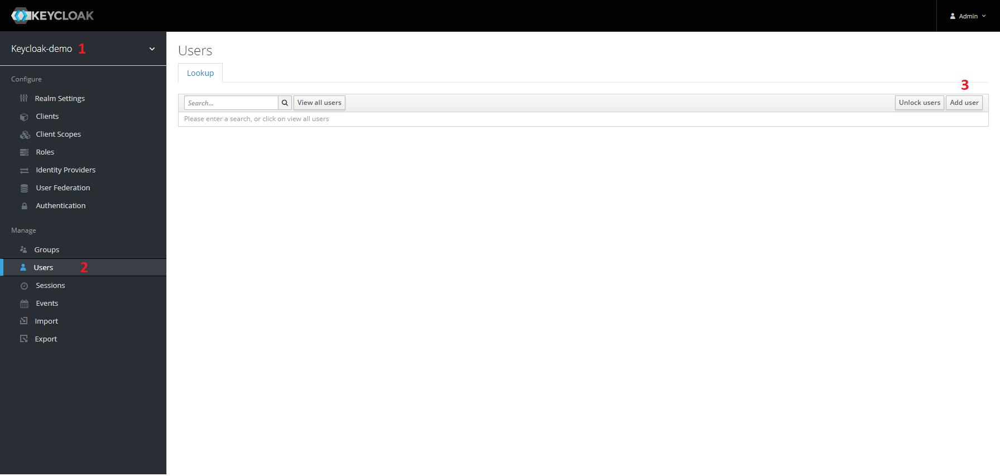

### Run Keycloak server
The following command will run the keycloak server and import automatically the realm `keycloak-demo` from the file `realm-export.json`.

#### Run using docker

**Note**: replace `ABSOLUTE_PATH` by the path to the file `realm-export.json`.
```shell
docker run --rm -p 8888:8080 -v <ABSOLUTE_PATH>/realm-export.json:/tmp/realm-export.json -e KEYCLOAK_USER=admin -e KEYCLOAK_PASSWORD=admin -e KEYCLOAK_IMPORT="/tmp/realm-export.json -Dkeycloak.profile.feature.upload_scripts=enabled" jboss/keycloak:9.0.3
```

#### Run using docker-compose

```shell
docker-compose up -d keycloak
```

### Access the Security Admin Console
Access the admin console with the credential provided in the command in the previous step.
http://localhost:8888/auth/

### Create a user
Create a user in the realm `keycloak-demo`.


Once it is created, set a password for the user. Then you will be able to login in the web application using that user.
